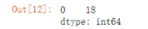

python统计分析

### 第一节：描述性统计分析

~~~python
import pandas as pd
import numpy as np
from scipy import stats
import os
insuance = pd.read_excel(r"C:\Users\DELL\Desktop\数学建模\2017国赛\B\附件二：会员信息数据.xlsx")
insuance
~~~

~~~python
insuance['age'].median()#中位数
~~~

~~~python
insuance['age'].quantile([0,0.05,0.25,0.5,0.75])#百分数
~~~

~~~python
insuance['age'].mode()#众数
~~~

~~~python
#分类变量
~~~

~~~python
#离散性数据
insurance['age'].max() - insurance['age'].min()#极差
~~~

~~~python
#四分位差
insuance['age'].quantile(0.75) - insuance['age'].quantile(0.25)
~~~

~~~python
insurance['charges'].mean()
~~~

~~~python
se = stats.sem(insurance['charges'])#计算样本均值标准误差
~~~

- 计算标准误差，std算的是总体标准偏差。

- 0.95的置信区间。

- 经过手动计算，算出来的置信区间左侧未12621.5300和上面算法相差无几。

### 第二节：假设检验

### 第三节：卡方分析和方差分析

# Python中的各种检验

### levene检验、T检验、卡方检验、F检验

#### 1.levene检验

~~~python
from scipy import stats
stats.levene(x, y) #检测两项之间的方差齐性。#x,y必须是一维。
#当结果大于0.05时，认为方差是相等的，当结果小于0.05时认为不相等。
~~~

#### 2.F检验

- F检验又叫方差齐性检验。在两样本t检验中要用到F检验
- 从两研究总体中随机抽取样本，要对这两个样本进行比较的时候，首先要判断两总体方差是否相同，即方差齐性。若两总体方差相等，则直接用t检验，若不等，可采用t"检验或变量变换或秩和检验等方法。

~~~python
model1 = SelectKBest(f_classif, k=2)#选择k个最佳特征  
model1.fit_transform(x, y)
model1.pvalues_
#p>0.05:方差具有齐次性，p<0.05:方差无差异
~~~

#### 3.卡方检验

~~~python
scipy.stats.chi2_contingency([x1,x2])[1]#取0为卡方值，取1为p_value
#p_value越大说明相关性越小，值越小说明他们的相关性越大。通常是检验自变量与标签之间的关系。
#在机器学习中
model1 = SelectKBest(chi2, k=2)#选择k个最佳特征  
model1.fit_transform(x, y)
model1.pvalues_
~~~

#### 4.T检验

~~~python
stats.ttest_ind(normal[:, i+1], cancer[:, i+1], equal_var=False) 
~~~

~~~python
#T检验还需要满足正态性检验，所以可以进行Q-Q图，直方图的检验。
~~~

#### 5.数据的归一化

- 数据归一化可以让数据符合正太分布，利于进行正态性检验。

#### 6.Box_Cox

这一变换可以使得线性回归模型在满足线性、正态性、 独立性‘方差齐性的同时又不丢失信息，在变换之后可以一定程度上减小不可观测的误差 和预测变量的 相关性，有利于线性模型的拟合以及分析出特征的相关性。#只能是正值且不能为0，所以先进行标准化，然后取abs绝对值。

~~~python
scipy.special.boxcox1p(x, lmbda)

from scipy.stats import boxcox 
scipy.stats.boxcox(x, lmbda=None, alpha=None)  #一列一列进行转化，通过迭代。
~~~

